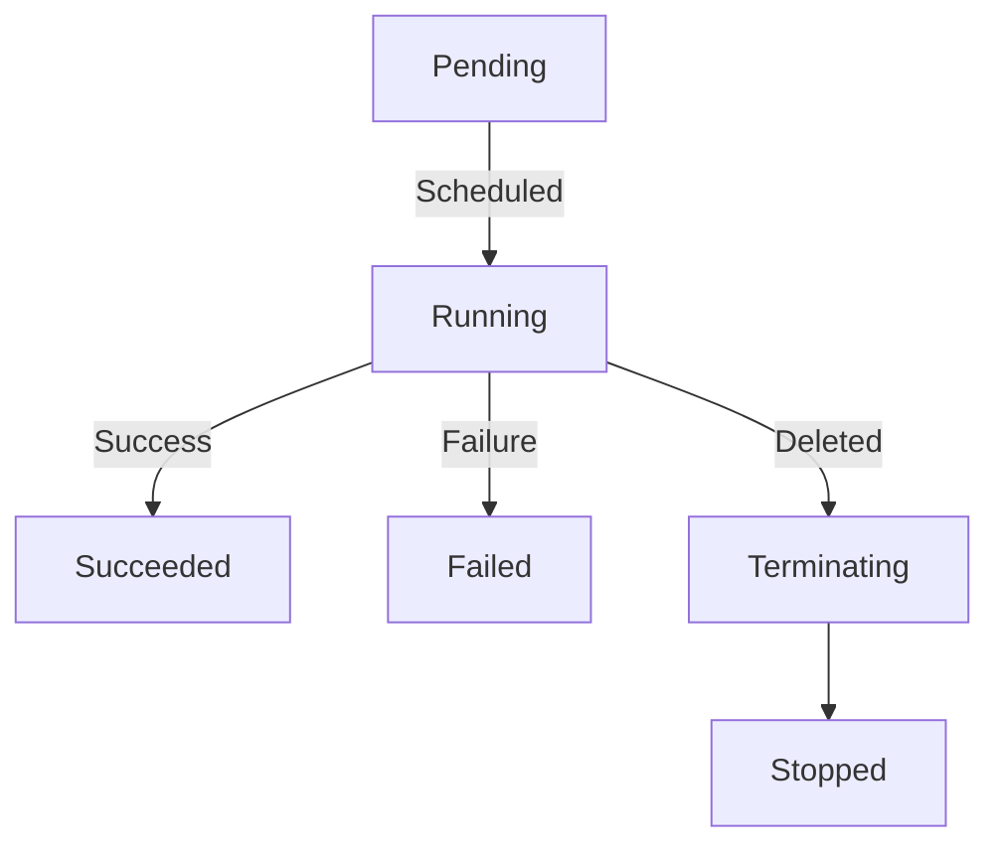

# **Kubernetes Pod Lifecycle**

## **Overview**
A Kubernetes **Pod** goes through different lifecycle phases from creation to termination. The lifecycle is managed by the **Kubelet** and depends on container states and restart policies.

---

## **1️⃣ Pod Phases**
A Pod has a `.status.phase` field that shows its current state. Possible values are:

| Phase      | Description |
|------------|-------------|
| **Pending** | Pod is accepted but waiting for resources (e.g., container images downloading). |
| **Running** | Pod has been scheduled and all containers are running or starting. |
| **Succeeded** | All containers have exited successfully and won’t restart. |
| **Failed** | One or more containers exited with a failure and won’t restart. |
| **Unknown** | The Pod state cannot be determined (usually due to a network issue). |

---

## **2️⃣ Container States**
Each container inside a Pod has a **state**, stored in `.status.containerStatuses.state`.

| State         | Description |
|--------------|-------------|
| **Waiting**  | Container is waiting to start (e.g., pulling images). |
| **Running**  | Container is running and healthy. |
| **Terminated** | Container has stopped (successfully or due to failure). |

### **Container Transitions**
- **Waiting → Running**: Once resources are available.
- **Running → Terminated**: When container completes execution or crashes.

---

## **3️⃣ Pod Lifecycle Events**
Kubernetes provides several hooks to manage Pod behavior during transitions.

### **Startup Probe (Optional)**
- Ensures a container has fully started before receiving traffic.
- Example:
  ```yaml
  startupProbe:
    httpGet:
      path: /healthz
      port: 8080
    failureThreshold: 3
    periodSeconds: 10
  ```

### **Liveness Probe**
- Checks if a container is still alive and restarts it if unresponsive.
- Example:
  ```yaml
  livenessProbe:
    exec:
      command: ["cat", "/tmp/healthy"]
    initialDelaySeconds: 5
    periodSeconds: 10
  ```

### **Readiness Probe**
- Checks if a container is ready to receive traffic.
- Example:
  ```yaml
  readinessProbe:
    tcpSocket:
      port: 8080
    initialDelaySeconds: 3
    periodSeconds: 5
  ```

### **PreStop Hook**
- Runs a command before a container stops.
- Example:
  ```yaml
  lifecycle:
    preStop:
      exec:
        command: ["/bin/sh", "-c", "sleep 5"]
  ```

### **PostStart Hook**
- Runs a command after the container starts.
- Example:
  ```yaml
  lifecycle:
    postStart:
      exec:
        command: ["/bin/sh", "-c", "echo Container started"]
  ```

---

## **4️⃣ Pod Deletion and Termination**
### **Graceful Shutdown Sequence**
1. Kubernetes sends a **SIGTERM** signal to the container.
2. The container executes the **PreStop hook** (if defined).
3. The container gets a **grace period** (default: 30s).
4. If still running after grace period, Kubernetes sends **SIGKILL** (force stop).

### **Force Deleting a Pod**
```sh
kubectl delete pod my-pod --grace-period=0 --force
```

---

## **Summary Diagram**


---

## **Conclusion**
Understanding Pod lifecycle helps in debugging and managing Kubernetes workloads efficiently. **Probes, lifecycle hooks, and restart policies** are key mechanisms to control Pod behavior.

Let me know if you need more details! 🚀

