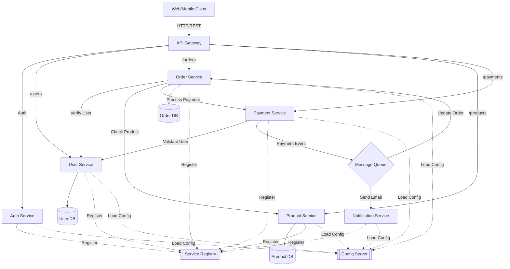

# Microservices Architecture Example

```mermaid
graph TD
    Client[Web/Mobile Client]
    Gateway[API Gateway]
    Auth[Auth Service]
    Users[User Service]
    Orders[Order Service]
    Products[Product Service]
    Payment[Payment Service]
    Notify[Notification Service]
    
    %% Databases
    UserDB[(User DB)]
    OrderDB[(Order DB)]
    ProductDB[(Product DB)]
    
    %% Message Queue
    Queue{Message Queue}
    
    %% Client Connection
    Client -->|HTTP/REST| Gateway
    
    %% Gateway Routes
    Gateway -->|Auth| Auth
    Gateway -->|/users| Users
    Gateway -->|/orders| Orders
    Gateway -->|/products| Products
    Gateway -->|/payments| Payment
    
    %% Service Dependencies
    Orders -->|Verify User| Users
    Orders -->|Check Product| Products
    Orders -->|Process Payment| Payment
    Payment -->|Validate User| Users
    
    %% Database Connections
    Users --> UserDB
    Orders --> OrderDB
    Products --> ProductDB
    
    %% Async Communications
    Payment -->|Payment Event| Queue
    Queue -->|Send Email| Notify
    Queue -->|Update Order| Orders
    
    %% Service Discovery
    ServiceRegistry[[Service Registry]]
    Config[[Config Server]]
    
    Auth -.->|Register| ServiceRegistry
    Users -.->|Register| ServiceRegistry
    Orders -.->|Register| ServiceRegistry
    Products -.->|Register| ServiceRegistry
    Payment -.->|Register| ServiceRegistry
    Notify -.->|Register| ServiceRegistry
    
    %% Load Config
    Auth -.->|Load Config| Config
    Users -.->|Load Config| Config
    Orders -.->|Load Config| Config
    Products -.->|Load Config| Config
    Payment -.->|Load Config| Config
    Notify -.->|Load Config| Config
```
